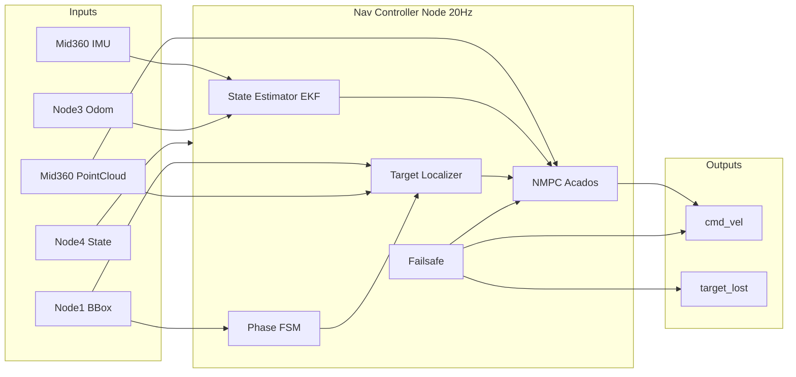

# oni_nav_controller 開発計画

## 1. 概要

| 項目 | 内容 |
|------|------|
| ノード名 | `oni_nav_controller` |
| 役割 | 自己位置・速度推定、ターゲット相対座標の融合、NMPC による `cmd_vel` 生成 |
| 制御周期 | **20 Hz 以上**（50 ms 以下） |
| プラットフォーム | **ROS 2 Humble**、3輪オムニ |
| NMPC ソルバー | **Acados** |

## 2. 使用技術スタック

| レイヤ | 技術 | 用途 |
|--------|------|------|
| ミドルウェア | ROS 2 Humble (`rclcpp`) | ノード・トピック・タイマー |
| 座標変換 | `tf2_ros`, `tf2_geometry_msgs` | カメラ↔LiDAR↔base_link |
| 点群処理 | `sensor_msgs/PointCloud2`, PCL (`pcl_ros`) | 視錐台フィルタ・クラスタリング |
| 状態推定 | 自前 EKF（Eigen3） | IMU + オドメトリ融合 |
| クラスタリング | PCL DBSCAN | 近距離フェーズの脚部検出 |
| 最適化 | **Acados** | NMPC ソルバー（C API） |
| 線形代数 | Eigen3 | EKF・運動学モデル |
| 設定 | YAML (`rclcpp` parameters) | 閾値・重み・制約 |
| ビルド | `ament_cmake` | C++ パッケージ |
| テスト | `ament_cmake_gtest`, `launch_testing` | 単体・統合テスト |

**言語方針**: リアルタイム性を考慮し **C++ を主言語**とする。Acados は C API を `nmpc_solver.cpp` でラップする。

## 3. 外部インターフェース（ROS 2）

### 3.1 入力トピック

| トピック名（案） | メッセージ型 | 送信元 | 内容 |
|------------------|--------------|--------|------|
| `/perception/bbox` | `oni_msgs/BBox` | Node 1 | 中心 `u`、高さ `h`、ロストフラグ |
| `/livox/imu` | `sensor_msgs/Imu` | Mid360 | 加速度・角速度 |
| `/livox/lidar` | `sensor_msgs/PointCloud2` | Mid360 | LiDAR 点群 |
| `/odom` | `nav_msgs/Odometry` | Node 3 | 車輪オドメトリ速度 |
| `/system/state` | `oni_msgs/SystemState` | Node 4 | FSM 状態 |

### 3.2 出力トピック

| トピック名（案） | メッセージ型 | 内容 |
|------------------|--------------|------|
| `/cmd_vel` | `geometry_msgs/Twist` | `linear.x/y`, `angular.z` |
| `/nav/target_lost` | `std_msgs/Bool` | Node 4 へのロスト通知 |
| `/nav/debug` | `oni_msgs/NavDebug` | フェーズ・`p_target`・コスト（開発用） |

### 3.3 TF

| フレーム | 役割 |
|----------|------|
| `base_link` | ロボット基準 |
| `camera_optical_frame` | BBox → 方位角 |
| `livox_frame` | LiDAR 点群 |

## 4. ファイル構成

```
oni_nav_contoler/
├── requirement.txt
├── plan.md
├── README.md
├── oni_msgs/
│   ├── CMakeLists.txt
│   ├── package.xml
│   └── msg/
│       ├── BBox.msg
│       ├── SystemState.msg
│       └── NavDebug.msg
├── oni_nav_controller/
│   ├── CMakeLists.txt
│   ├── package.xml
│   ├── config/
│   │   └── nav_controller.yaml
│   ├── launch/
│   │   └── nav_controller.launch.py
│   ├── include/oni_nav_controller/
│   │   ├── nav_controller_node.hpp
│   │   ├── state_estimator.hpp
│   │   ├── target_localizer.hpp
│   │   ├── nmpc_solver.hpp          # Acados ラッパー
│   │   ├── obstacle_model.hpp
│   │   ├── phase_fsm.hpp
│   │   ├── failsafe.hpp
│   │   └── types.hpp
│   ├── src/
│   │   ├── nav_controller_node.cpp
│   │   ├── state_estimator.cpp
│   │   ├── target_localizer.cpp
│   │   ├── nmpc_solver.cpp          # Acados OCP 生成コード連携
│   │   ├── obstacle_model.cpp
│   │   ├── phase_fsm.cpp
│   │   └── failsafe.cpp
│   ├── acados/                      # Acados コード生成出力先
│   │   └── (generated C sources)
│   └── test/
│       ├── test_state_estimator.cpp
│       ├── test_target_localizer.cpp
│       ├── test_phase_fsm.cpp
│       └── test_nmpc_solver.cpp
└── oni_nav_bringup/                 # 統合起動（任意）
    └── launch/
        └── oni_nav.launch.py
```

## 5. モジュール別 関数・クラス設計

### 5.1 `NavControllerNode`

| 関数 | 責務 |
|------|------|
| `onBBox()` | BBox 受信・タイムスタンプ更新 |
| `onImu()` | IMU バッファへ格納 |
| `onPointCloud()` | 最新点群を共有ポインタで保持 |
| `onOdom()` | オドメトリ速度を EKF へ |
| `onSystemState()` | Node 4 状態に応じた有効/無効 |
| `controlLoop()` | 50 ms タイマー: 推定→目標→NMPC→publish |
| `publishCmdVel()` | `geometry_msgs/Twist` 出力 |
| `publishTargetLost()` | フェイルセーフ通知 |

### 5.2 `StateEstimator`（EKF）

**状態ベクトル**: `x = [x, y, θ, vx, vy, ω]ᵀ`

| 関数 | 責務 |
|------|------|
| `predict(dt, imu)` | 運動学 + IMU による予測ステップ |
| `updateOdom(v_odom)` | オドメトリ速度による観測更新 |
| `getState()` | 現在状態返却 |
| `reset(x0)` | 初期化 |

### 5.3 `TargetLocalizer`

| 関数 | 責務 |
|------|------|
| `updateBBox(bbox)` | BBox 情報更新 |
| `computePhaseA()` | `φ`, `d_pseudo = K/h`, `p_target` |
| `computePhaseB(cloud, tf)` | 視錐台投影→フィルタ→DBSCAN→クラスタ重心 |
| `getTarget()` | `Eigen::Vector2d p_target` |
| `isTargetValid()` | 座標の信頼性 |

補助: `bboxToBearing()`, `heightToDistance()`, `projectFrustum()`, `filterPointsInFrustum()`, `clusterLegs()`

### 5.4 `PhaseFsm`

| 関数 | 責務 |
|------|------|
| `update(h, lidar_valid)` | A↔B 遷移（ヒステリシス付き） |
| `getPhase()` | `PHASE_A` / `PHASE_B` |
| `hysteresisThreshold(h)` | `h_thresh ± margin` 判定 |

### 5.5 `NmpcSolver`（Acados ラッパー）

**制御入力**: `u = [ax, ay, α]ᵀ`

**状態方程式**:

```
ẋ = [vx·cosθ - vy·sinθ, vx·sinθ + vy·cosθ, ω, ax, ay, α]ᵀ
```

| 関数 | 責務 |
|------|------|
| `setup(N, dt, Q, R, S, constraints)` | Acados OCP 初期化 |
| `setTarget(p_target)` | 追従目標（コストパラメータ更新） |
| `setObstacles(pointcloud)` | 障害物ペナルティ用データ登録 |
| `setInitialState(x0)` | 現在状態を `x0` に設定 |
| `solve()` | `ocp_nlp_solve()` 実行 |
| `getFirstVelocity()` | `v_next = [vx, vy, ω]` 抽出 |

**Acados 実装方針**:
- Python (`acados_template`) で OCP を定義し C コードを生成、`acados/` に配置
- 非線形コスト（ターゲット追従 Q、制御 R、滑らかさ S）をステージコストとして定式化
- 障害物項 `I_obs` は外部パラメータ化したバリア関数としてステージコストに追加
- 速度・加速度制約を `lh`/`uh` ボックス制約として設定
- warm start: 前回の解を `ocp_nlp_out_set()` で初期値として利用

### 5.6 `ObstacleModel`

| 関数 | 責務 |
|------|------|
| `buildObstacleSet(cloud, exclude_target)` | ターゲット以外の点群 |
| `minDistance(p, obstacles)` | 点 p から最近傍距離 |
| `barrierCost(d, d_safe)` | 障害物ペナルティ |

### 5.7 `Failsafe`

| 関数 | 責務 |
|------|------|
| `updateLost(bbox_lost, lidar_empty, dt)` | 300 ms タイマー |
| `shouldStop()` | 即停止判定 |
| `onTargetLost()` | 減速・ゼロ速度、`target_lost` 発火 |
| `onLidarOcclusion()` | B→A フォールバック or デッドレコニング |
| `deadReckonTarget(v, dt)` | 直前ベクトルから `p_target` 補間 |

## 6. データフロー



## 7. 実装フェーズ

### Phase 0: 基盤構築 ✅ 完了

1. `oni_msgs` パッケージ作成
2. `oni_nav_controller` の `ament_cmake` スケルトン
3. `config/nav_controller.yaml` に全パラメータ定義
4. `NavControllerNode` のサブスクライバ・50 ms タイマー・`cmd_vel` パブリッシュ（スタブ）

**完了条件**: `ros2 launch` でノード起動、ダミー `cmd_vel` が 20 Hz で出る。

### Phase 1: 状態推定器 ✅ 完了

1. `types.hpp` に状態・パラメータ構造体
2. `StateEstimator` の predict / update 実装
3. 単体テスト（5件パス）

**完了条件**: IMU + Odom シミュレーションで `x_t` が妥当。

### Phase 2: ターゲット座標特定 ✅ 完了

1. `PhaseFsm`（ヒステリシス）
2. フェーズ A: BBox → `p_target`
3. フェーズ B: 視錐台投影、DBSCAN クラスタリング
4. `Failsafe` のデッドレコニング・フォールバック
5. 単体テスト（PhaseFsm 4件、TargetLocalizer 4件）

**完了条件**: モック BBox/点群で A/B 切替と `p_target` 出力が確認できる。

### Phase 3: NMPC ソルバー（Acados） ✅ 完了

1. `scripts/generate_nmpc_solver.py` で OCP 定義・C コード生成（`c_generated_code/`）
2. 運動学モデル + コスト関数（Q, R, S, 障害物バリア）の定式化
3. `ObstacleModel` + `NmpcSolver` ラッパー（SQP-RTI warm start）
4. `NavControllerNode` 統合（CHASE 状態で `cmd_vel` 出力）
5. 単体テスト（ObstacleModel 2件、NmpcSolver 2件）

**完了条件**: 固定 `p_target` で求解成功、ビルド・テスト通過。

**ビルド要件**: `deps/acados_install`（Acados v0.3.6）を CMake が自動検出。
コード再生成: `ACADOS_SOURCE_DIR=../deps/acados python3 scripts/generate_nmpc_solver.py`

### Phase 4: 統合・フェイルセーフ ✅ 完了

1. `MotionController` で減速・再探索旋回・Node 4 状態連携
2. ターゲットロスト 300 ms → 減速停止 + `/nav/target_lost` 通知（復帰時に false）
3. BBox ロスト時も直前 BBox で視錐台 LiDAR 判定
4. `NavDebug.nav_status` 追加、`mock_nav_test.launch.py` で統合テスト可能

**完了条件**: エンドツーエンドで追従・ロスト・障害物回避が動作。

### Phase 5: チューニング・テスト（継続）

1. 実機/シミュでのパラメータ調整
2. スリップ時の EKF ゲイン調整
3. 性能プロファイリング（20 Hz 維持確認）

## 8. 主要パラメータ（`nav_controller.yaml`）

```yaml
control_rate_hz: 20.0

# Target localization
h_thresh: 120.0
h_hysteresis: 15.0
K_calib: 200.0
human_height: 1.7

# NMPC (Acados)
horizon_N: 20
dt: 0.05
v_max: 1.0
omega_max: 2.0
a_max: 2.0
alpha_max: 4.0
d_safe: 0.4
Q: [10.0, 10.0]
R: [0.1, 0.1, 0.1]
S: [1.0, 1.0, 1.0]

# Failsafe
target_lost_timeout_ms: 300
reacquire_spin_rate: 0.3
```

## 9. リスクと対策

| リスク | 対策 |
|--------|------|
| Acados 求解が 50 ms を超える | ホライゾン N 短縮、warm start、SQP 反復回数制限 |
| フェーズ A/B チャタリング | ヒステリシス + 最低滞在時間 |
| LiDAR–カメラ TF ずれ | キャリブレーション YAML、static TF |
| スリップで EKF 破綻 | オドメトリ観測ノイズを速度依存で可変 |
| Node 1/3/4 未実装 | モックパブリッシャーで並行開発 |

## 10. 推奨実装順

1. `oni_msgs` + ノード骨格
2. フェーズ A のみ（BBox → `p_target`、開ループ追従）
3. EKF（状態フィードバック）
4. Acados NMPC 基本形（障害物なし）
5. 障害物項 + フェーズ B + フェイルセーフ
